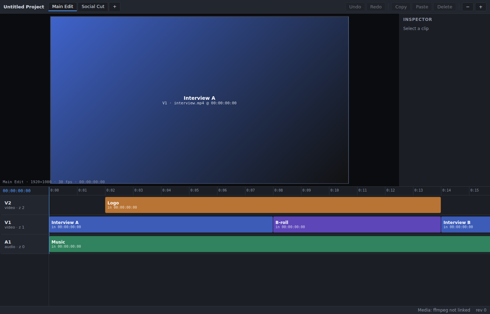
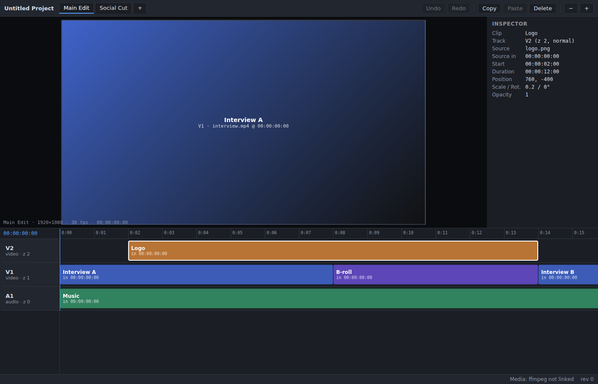

# Potential Goggles

[](https://github.com/pmroz1/potential-goggles/actions/workflows/ci.yml)
[](https://github.com/pmroz1/potential-goggles/actions/workflows/release-windows.yml)

A desktop-only, performance-oriented video editor in its early stages. Arrange
clips across video and audio tracks, adjust layers in the viewport, and undo or
redo edits. Create, open and save projects (`.pgproj`), import media by button or
by dropping files into the window, and add them to the timeline.

- **Playback** (Space, or Play/Pause/Stop) advances the playhead in real time.
  The viewport shows the actual video frames and images of every visible layer.
  Preview audio is muted (there is no audio output yet).
- **Formats**: MP4, MOV, M4V and WebM video and PNG, JPEG, GIF, WebP and BMP images
  are previewed directly. Other formats (MKV, AVI, WMV, FLV, MPEG/TS, MXF, 3GP, OGV,
  DV, …; TIFF, TGA, AVIF, HEIC, JPEG XL images) and any other file FFmpeg can probe
  are imported too; their previews are converted once with FFmpeg and cached in the
  temp folder. Files a direct preview can't decode (e.g. an unsupported codec inside
  an MP4) fall back to conversion automatically. Audio files (WAV, MP3, AAC, FLAC, OGG, Opus, …) go on audio tracks.
- **Loading feedback**: imports show placeholders in the media bin and an activity
  spinner in the status bar; layers show "Loading preview…" / "Converting for preview…"
  until their media is ready.
- **Tracks**: add tracks with **+ Video** (on top of the stack) / **+ Audio** below the
  timeline headers, and remove one with **×** on its header (undoable; locked tracks
  can't be removed).
- **Resizing**: select a layer in the viewport and drag its handles. Corner handles
  keep the proportions (hold Shift to resize freely); edge handles stretch one side.
  The inspector sets an exact width/height and offers **Fit**, **Fill**, **Stretch**
  and **Original** (restore the source proportions). The **Sequence → Frame** menu
  changes the video's proportions (16:9, 9:16, 1:1, 4:5, 4:3, 21:9, 4K, or a custom size).
- **Export** (Ctrl/Cmd+E) renders the active sequence to MP4 (H.264/AAC) at the
  sequence's resolution and frame rate, compositing video tracks with their
  transforms, opacity and blend modes and mixing audio-track clips. Audio
  embedded in video clips is not included.
- Export, media probing (real durations and sizes on import) and preview conversion need
  [FFmpeg](https://ffmpeg.org/) (`ffmpeg` and `ffprobe`) on your `PATH`; it is not
  bundled with the installer. Without it, Export is disabled and only formats the
  webview plays natively can be previewed.

## Preview

The previews below (captured with an earlier sample project) show the editor with placeholder media:





## Windows download

Download the latest Windows `.exe` installer from
[Releases](https://github.com/pmroz1/potential-goggles/releases). The installer
is currently unsigned, so Windows may show a SmartScreen warning. Releases do
not include a standalone portable executable.

Maintainers: run the [Windows release workflow](https://github.com/pmroz1/potential-goggles/actions/workflows/release-windows.yml)
manually to download an installer from its `windows-installer` build artifact,
or push a `v*` tag (for example, `v0.1.0`) to build an installer and publish it
as a GitHub Release asset. Match the tag to the version in
`src-tauri/tauri.conf.json` and `Cargo.toml` before tagging.

| Layer            | Technology                                   | Location               |
| ---------------- | -------------------------------------------- | ---------------------- |
| UI               | Angular + TypeScript (zoneless, signals)     | `src/`                 |
| Desktop shell    | Tauri 2                                       | `src-tauri/`           |
| Editing core     | Rust (`editor-core` crate)                   | `crates/editor-core/`  |
| Media boundary   | Rust (`media` crate, FFmpeg integration point) | `crates/media/`       |

There is no separate backend service: the Rust core runs inside the Tauri process.

## Prerequisites

- Node.js 22+ and npm
- Rust (stable, 1.90+)
- Platform dependencies for Tauri 2 — see <https://v2.tauri.app/start/prerequisites/>
  (on Debian/Ubuntu: `libwebkit2gtk-4.1-dev libgtk-3-dev librsvg2-dev libayatana-appindicator3-dev libxdo-dev libssl-dev`)

## Commands

```sh
npm install

npm run tauri dev            # run the desktop app with live reload
npm run tauri build          # build release binaries + installers

npm test -- --watch=false    # Angular unit tests (Vitest)
npm run build                # production frontend build
cargo test --workspace       # Rust tests (requires a frontend build for src-tauri)
cargo clippy --workspace --all-targets -- -D warnings
cargo fmt --all
```

`npm start` serves the UI in a browser, but the editor needs the Tauri shell
for its backend, so use `npm run tauri dev` for development.

## Core concepts

- **Project** → owns a media pool (`MediaSource`) and any number of **sequences** (timelines).
- **Sequence** → frame rate, resolution and **tracks**.
- **Track** → video or audio, with an explicit `zIndex` that defines compositing order
  (higher is drawn on top) plus blend mode, visibility, mute and lock flags.
- **Clip** → a `SourceRef` (source id + in point), a timeline `start` and `duration`,
  a spatial `transform` (position, uniform `scale`, per-axis `scaleX`/`scaleY` stretch and
  rotation) and `opacity`. Clips on a track never overlap.
- Time is stored as integer **ticks** (705,600,000 per second, the "flick"), which divides
  evenly into common frame rates (incl. 29.97/59.94) and audio sample rates.

### Edit operations

All project mutations are serializable `EditOp`s (`moveClip`, `setClipTransform`,
`trimClip`, `splitClips`, `deleteClips`, `pasteClips`, `addSequence`, `addTrack`, `removeTrack`,
`setSequenceResolution`, …) applied atomically by `Editor`: an operation
either fully succeeds and becomes one undo step, or is rejected and leaves the project untouched.

### Pointer interaction and IPC

Dragging clips on the timeline or layers in the viewport is handled entirely in the UI:

- pointer listeners are attached natively (no Angular change detection per move);
- moves are coalesced to one update per animation frame and applied as a CSS `translate`
  on the dragged element only (with frame snapping and local placement pre-validation);
- **no IPC happens during the drag** — on release a single `moveClip` / `setClipTransform`
  operation (resize handles work the same way, previewing with a CSS `scale`) is committed to the Rust core, which validates it and returns the new snapshot.

### Trimming and splitting

- Drag the left or right edge of a timeline clip to change when it starts or ends. Trimming
  the start also moves the clip's source in point, so the remaining frames stay in place.
  Video and audio clips can't grow past their source media; **still images can be stretched
  to any length** (e.g. to cover a whole video). Edges snap to frames, other clip edges and
  the playhead, and stop at neighbouring clips. One `trimClip` is committed on release.
- **Split** (`S`) cuts the selected clips at the playhead into two clips — or every clip under
  the playhead (on unlocked tracks) when nothing is selected. It is one undoable `splitClips`
  operation.

### Clipboard

Copy (`Ctrl/Cmd+C`) builds a structured `ClipboardPayload`
(`application/x-potential-goggles-clips`, versioned) holding complete clip data plus each
clip's time offset from the earliest copied clip and its lane offset in the z-ordered track
stack. Paste (`Ctrl/Cmd+V`) inserts copies with new ids at the playhead, preserving all clip
properties and relative layout. Clips go onto their original tracks, or — when a target track
is selected (click a track header/lane) — relative to that track. Paste is a single undoable
operation.

Other shortcuts: `Ctrl/Cmd+Z` undo, `Ctrl/Cmd+Shift+Z` / `Ctrl/Cmd+Y` redo, `Delete` removes
selected clips, `S` splits at the playhead. Click/drag the ruler to move the playhead.

### Media / FFmpeg

`crates/media` defines the `MediaBackend` trait (probe, export and preview conversion),
implemented by the FFmpeg command-line backend. The viewport loads media through Tauri's asset
protocol: the `prepare_preview` command allows exactly one file per request (the original when
the webview can decode it, otherwise an H.264 MP4 / PNG proxy generated by `make_preview`), so
the asset scope is empty by default. Imports run off the UI thread.
